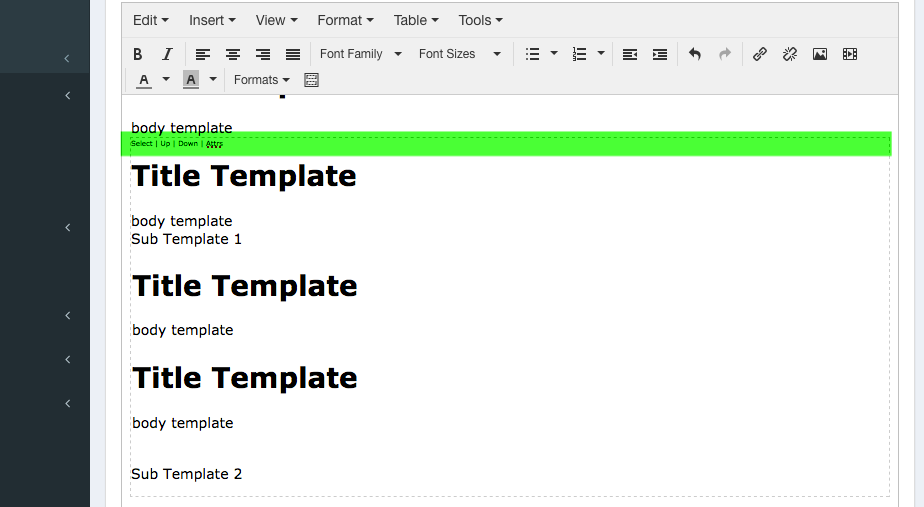

# Camaleon CMS - Tinymce Templates Visualization
Permit to manage tinymce templates with better visualization.



##Installation
* Add to your Gemfile
```
gem 'cama_tinymce_template', github: 'owen2345/Camaleon-Tinymce-Templates'
```
* Bundle install
* Restart server
* Go to admin -> plugins -> inactive plugins -> install plugin
* Create/Register your templates
    - Register the hook "admin_before_load" in your config.json
    ```
    "admin_before_load": ["my_theme_admin_before_load"]
    ```
    - Create the helper listener for the hook which will append a new javascript with our templates
    ```
    def my_theme_admin_before_load
        append_asset_libraries({"my_tinymce"=> { js: [theme_asset("js/my_tinymce_templates")]}})
    end
    ```
    - Create the js file 'my_theme/assets/js/my_tinymce_templates.js'
    ```
    jQuery(function(){
        tinymce_global_settings["settings"].push(my_custom_function);
    });
    function my_custom_function(custom_settings, def_settings){
        def_settings['templates'] = def_settings['templates'] || [];
        def_settings['templates'].push({title: 'Simple Template', description: 'This is a simple template', content: '<div class="mceTmpl"><h1>Title Template</h1><div>body template</div></div>'});
    }
    ```
    Note: Don't forget "mceTmpl" class name.
    
* Go to page editor and insert your template
